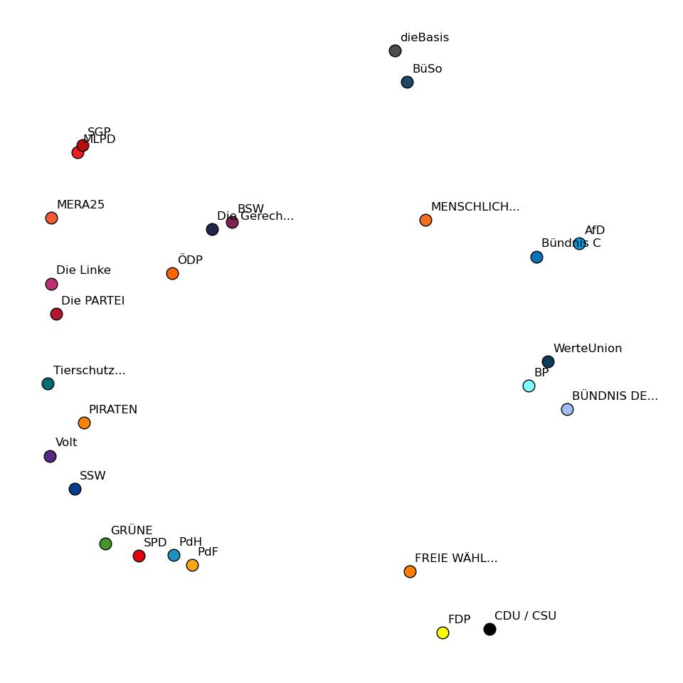

# PCA Wahlanalyse

Dies ist ein Repository, um die Wahlprogramm von Parteien mithilfe der [Hauptkomponentenanalye](https://de.wikipedia.org/wiki/Hauptkomponentenanalyse) (engl. principal component analysis, PCA) zu untersuchen. Als Grundlage werden die Antworten der jeweiligen Parteien auf die Thesen des [Wahl-O-Mats](https://www.wahl-o-mat.de/) verwendet. Die Daten werden in diesem Notebook nicht gespeichert, sondern beim Ausführen der Notebooks heruntergeladen.

Als Beispiele stehen mehrere Notebooks zur Verfügung:

1. [Kleine Einführung zur Hauptkomponentenanalyse](notebooks/beispiel_pca.ipynb) 
2. [Bundestagswahl 2025](notebooks/beispiel_btw2025.ipynb) 
3. [Hamburger Bürgerschaftswahl 2025](notebooks/beispiel_hh2025.ipynb) 